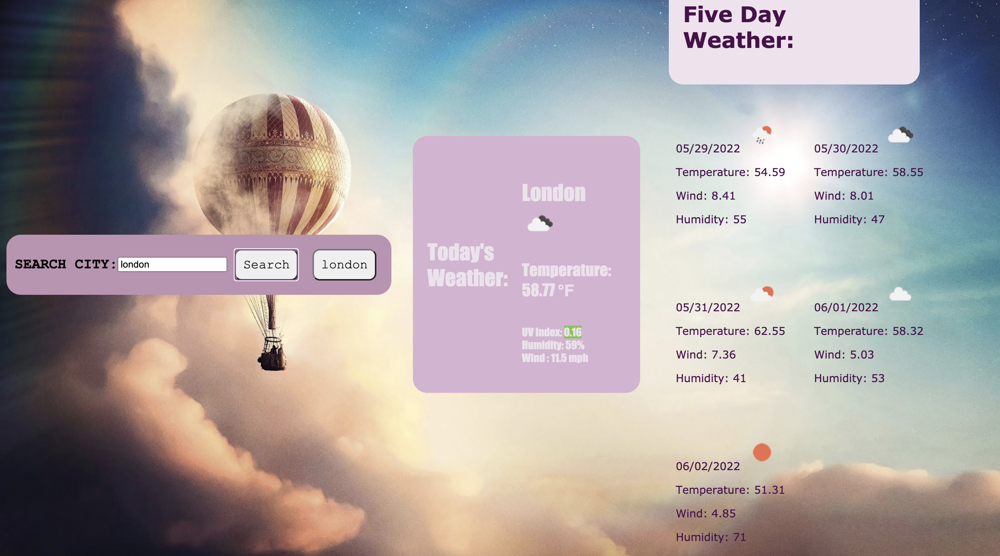
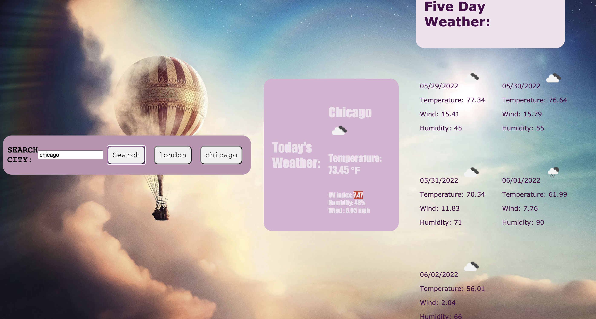

##Weather App
when user inputs city, they are given a current weather witha color-coded uv index indicator and a corresponding weather icon.
when user inputs city they also giet a 5-day weather forecast.
When user enters city names, they all are recorded in local storage.

This website is created to provide the user with trusted weather information in an aesthetically plesing site. This site allows users to search any city and store their recent searcher for easier navigation.

###

link to deployed website:
https://anacecyflores1.github.io/WeatherDashboard/

### Screenshot:

### Technologies Used:

Open Weather Api- Used weather API to retrieve current weather and up to a five day forecast for any user input's location.
Javascript- Allowed for the functunality of app to work at a real time section. Allowed for user to save recent searches to Local Storage.
